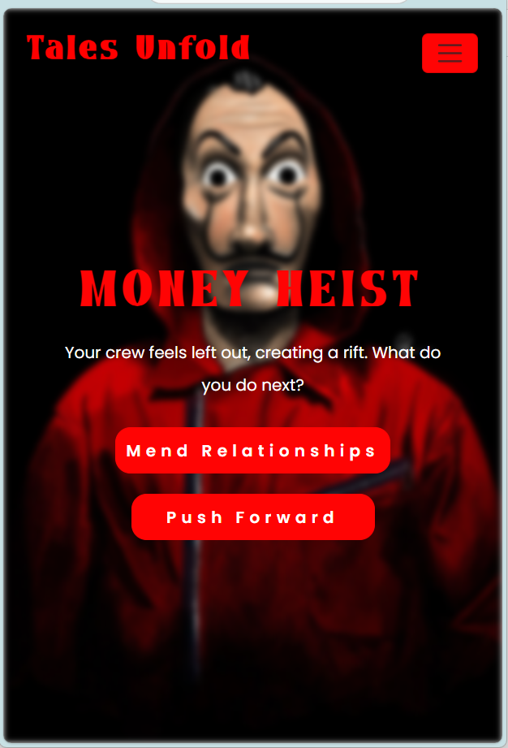
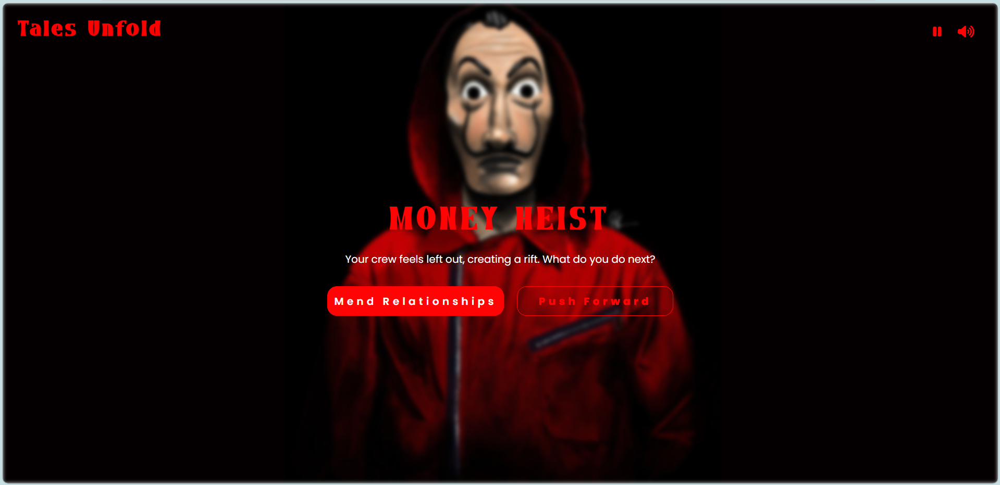

# Interactive Story Game
## 📖 Overview
Embark on a thrilling heist adventure where you are the mastermind. In this interactive story game, every decision you make shapes the narrative, leading to multiple possible outcomes. Crafted with JavaScript, the game offers dynamic storytelling, smooth scene transitions, and immersive audio controls, allowing players to manage background music for a personalized experience.

## 🎮 Features
* Dynamic Storytelling: Your choices directly influence the storyline, ensuring a unique experience with each playthrough.​

* Seamless Transitions: Enjoy smooth scene changes that enhance engagement and immersion.​

* Audio Controls: Manage background music to suit your preferences, enriching the overall atmosphere.​

## 🛠️ Technologies Used
* JavaScript: For dynamic content and game logic.​

* HTML5 & CSS3: To structure and style the game interface.​
GitHub

## 🚀 Getting Started
Follow these steps to run the game locally:

1. Clone the Repository:
```bash
git clone https://github.com/dev-harisk/Interactive-Story-Game.git
cd Interactive-Story-Game
```
2. Open the Game:

   Simply open the index.html file in your preferred web browser.

## 🖼️ Screenshots

### 📌 Home Page


### 📌 Desktop View


### 📌 Mobile View


## 🤝 Contributing
Contributions are welcome! To contribute:

1. Fork the Repository
2. Create a New Branch:
```bash
git checkout -b feature-name
```
3. Commit Your Changes:
```bash
git commit -m "feat: add new feature"
```
4. Push to the Branch:
```bash
git push origin feature-name
```
5. Open a Pull Request

## 📄 License
This project is licensed under the MIT License.
